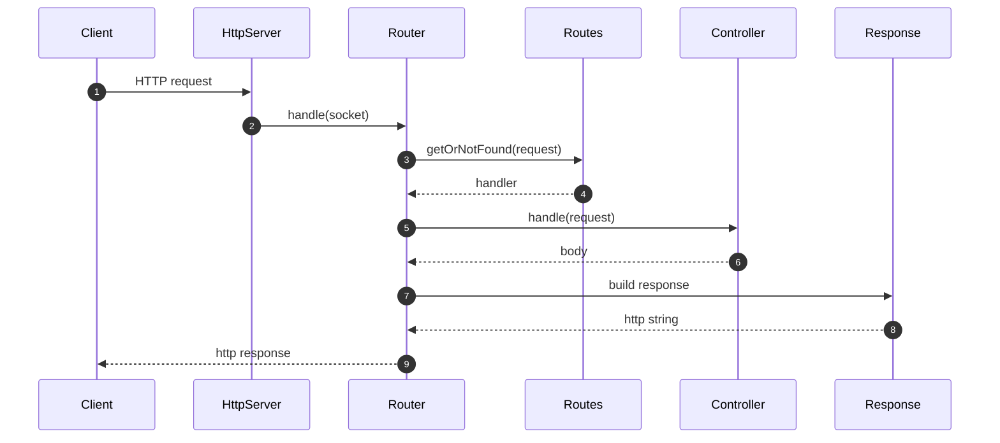
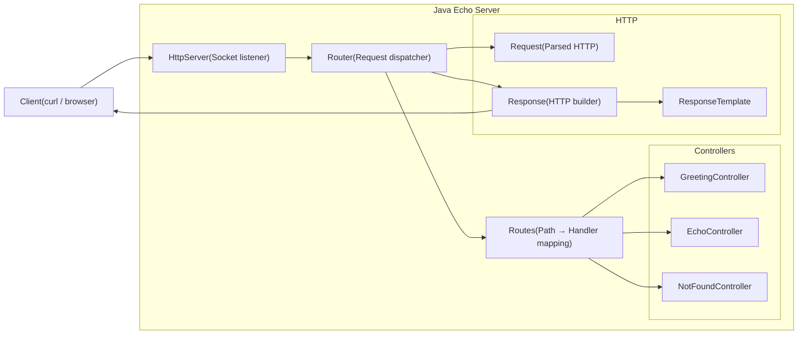

# Simple Java HTTP Server

This project implements a minimal, educational HTTP server in Java.  
The goal is to understand low-level request handling, routing, controllers, and response building without relying on large frameworks.

It includes:

- Socket-based HTTP server  
- Basic router and mapping system  
- Controllers implementing a `RequestHandler` interface  
- Request parsing (method, path, headers, body)  
- Response builder with support for multiple formats  
- A complete class diagram for architecture visibility

---

## 🚀 Overview

The server listens on a configurable port and processes each incoming socket by:

1. Parsing the HTTP request into a `Request` object  
2. Passing it to the `Router`  
3. Resolving the appropriate `RequestHandler` via `Routes`  
4. Building the HTTP response with `Response` helpers  
5. Sending the result back through the socket

The structure is intentionally simple so you can extend it — adding controllers, middleware, or even template rendering.

---

## 📦 Project Structure

```text
java-echo-server/
├── README.md
├── src
│   └── main
│       └── java
│           └── com
│               └── server
│                   ├── controller
│                   │   ├── EchoController.java
│                   │   ├── GreetingController.java
│                   │   ├── NotFoundController.java
│                   │   └── RequestHandler.java
│                   ├── http
│                   │   ├── HttpMethod.java
│                   │   ├── HttpServer.java
│                   │   ├── Request.java
│                   │   └── Response.java
│                   ├── Main.java
│                   ├── router
│                   │   ├── Router.java
│                   │   └── Routes.java
│                   └── utils
│                       └── ResponseTemplate.java
└── tests
    ├── load_get_greeting.sh
    ├── load_post_message.sh
    └── run_all_load_tests.sh
```

## 🧩 Class Diagram

Below is a full Mermaid UML diagram representing the architecture:



## 🧱Architecture Overview


